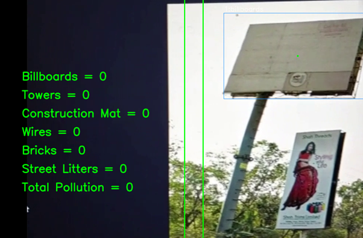

# Visual-Pollution-Detection-And-Quantification-Application-from-Vehicle
A visually polluted object (VPO) detection and quantification application using python where we had YOLOv7 trained weights as the backend deep learning model.

## Introduction: 
This application, a prototype, uses video files with a resolution of 1280x720 pixels. Assuming that the video was captured from a moving vehicle, the video is panned either from right to left or from left to right. The application then analyses the full video clip to find the visually polluted objects and assigns each one a distinct ID to identify it as a unique object and prevent double counting. The counting area is defined by the two vertical green lines. The polluting object is counted and taken into consideration when it falls within these two vertical lines. The statistics interface on the left shows the overall number of items counted as well as the number of objects counted for each class. 

This app is based on YOLOV7 object detection library engine from krisnarengga repository on https://github.com/krisnarengga/yolov7-vehicle-counting and based on DeepSort object tracking implementation

## Running the Application
Run this command to run the app

```python
python detect_count_and_track.py --weights best.pt --conf 0.55 --source pollution.mp4 --view-img --nosave --no-trace
```

## Screenshot:


## Demo Video
App Demo Video:
https://drive.google.com/file/d/1oTIL3M1tw8yzKpfGNkCFqqFVSTd_yoCs/view?usp=sharing

Sample Video is given in the repository.

